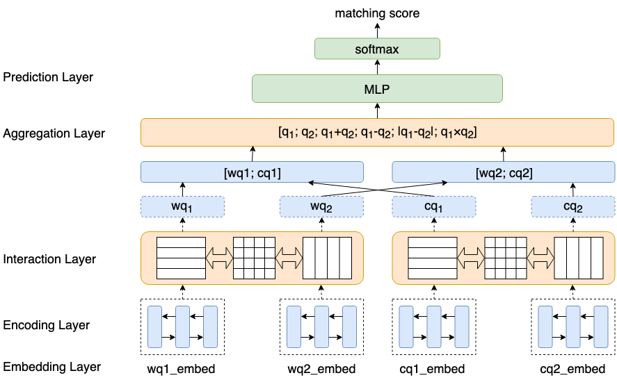

[TOC]

# QQ Similarity

## 数据

接口机100.88.66.85，数据所在文件路径：**/ceph/qbkg2/aitingliu/qq/data**

根据日期进行版本管理及存储：如20190726、20190809等

每个日期文件夹下又会有以下几个文件夹：

> raw：用于交叉熵损失函数的模型
>
> triplet：用于max-margin-loss的模型
>
> for_bert（optional）：用于BERT

每个文件夹下会有以下文件：（以20190809版本数据为例）

| raw文件夹下的文件            | 备注                                       | 格式                     |
| ---------------------------- | ------------------------------------------ | ------------------------ |
| merge_20190809_check_seg.txt | 分词后的标注数据，切分得到train/dev/test集 | query\tquestion\tlabel\n |
| train.txt                    | 训练集（197794）                           | query\tquestion\tlabel\n |
| dev.txt                      | 验证集（10000）                            | query\tquestion\tlabel\n |
| test.txt                     | 测试集（10000）                            | query\tquestion\tlabel\n |
| word.txt                     | word level 词典（38910）                   | word\n                   |
| char.txt                     | char level 词典（4229）                    | char\n                   |

| triplet文件夹下的文件 | 备注                     | 格式                                |
| --------------------- | ------------------------ | ----------------------------------- |
| train.txt             | 训练集（116424）         | query\t正例question\t负例question\n |
| dev.txt               | 验证集（10000）          | query\t正例question\t负例question\n |
| test.txt              | 测试集（10000）          | query\t正例question\t负例question\n |
| word.txt              | word level 词典（28637） | word\n                              |
| char.txt              | char level 词典（3793）  | char\n                              |

| for_bert文件夹下的文件 | 备注             | 格式                          |
| ---------------------- | ---------------- | ----------------------------- |
| train.csv              | 训练集（197794） | idx\tquery\tquestion\tlabel\n |
| dev.csv                | 验证集（10000）  | idx\tquery\tquestion\tlabel\n |
| test.csv               | 测试集（10000）  | idx\tquery\tquestion\tlabel\n |

## 模型

APLSTM/APCNN ：[Attentive Pooling Networks](https://arxiv.org/pdf/1602.03609.pdf)

ARCII : [Convolutional Neural Network Architectures for Matching Natural Language Sentences](http://papers.nips.cc/paper/5550-convolutional-neural-network-architectures-for-matching-natural-language-sentences.pdf)

Siamese LSTM/CNN : [Semi-supervised Clustering for Short Text via Deep Representation Learning](https://arxiv.org/pdf/1602.06797.pdf)；[Siamese Recurrent Architectures for Learning Sentence Similarity](https://www.aaai.org/ocs/index.php/AAAI/AAAI16/paper/viewFile/12195/12023)

BiMPM : [Bilateral Multi-Perspective Matching for Natural Language Sentences](https://arxiv.org/pdf/1702.03814.pdf)

FastText :  [Bag of Tricks for Efficient Text Classification](https://arxiv.org/pdf/1607.01759.pdf)

TextCNN : [Convolutional Neural Networks for Sentence Classification](https://arxiv.org/pdf/1408.5882.pdf)

ESIM：[Enhanced LSTM for Natural Language Inference](https://arxiv.org/pdf/1609.06038.pdf)

Siamese LSTM self-attention：[A Structured Self-attentive Sentence Embedding](https://arxiv.org/pdf/1703.03130.pdf)

### 模型框架图

## Result

### 20190715

| 模型     | 指标            | AUC        | ACC        | PRE        | REC        | F1         | 阈值 | 备注             |
| -------- | --------------- | ---------- | ---------- | ---------- | ---------- | ---------- | ---- | ---------------- |
| FastText | QQ Pair级别指标 | 0.8007     | 0.7611     | 0.5982     | 0.6780     | 0.6356     | 0.33 | 最高F1，30 epoch |
| FastText | QQ Pair级别指标 | 0.8007     | 0.7669     | 0.6174     | 0.6349     | 0.6261     | 0.8  | 高阈值，30 epoch |
| FastText | QQ Pair级别指标 | 0.8007     | **0.7694** | **0.6272** | 0.6157     | 0.6214     | 0.9  | 高阈值，30 epoch |
| TextCNN  | QQ Pair级别指标 | 0.7226     | 0.6203     | 0.4360     | 0.8025     | 0.5650     | 0.33 | 最高F1，28 epoch |
| TextCNN  | QQ Pair级别指标 | 0.7226     | 0.6501     | 0.4562     | 0.7216     | 0.5590     | 0.8  | 高阈值，28 epoch |
| TextCNN  | QQ Pair级别指标 | 0.7226     | 0.6617     | 0.4654     | 0.6799     | 0.5526     | 0.9  | 高阈值，28 epoch |
| SCWLSTM  | QQ Pair级别指标 | **0.8202** | 0.7328     | 0.5446     | 0.7953     | **0.6465** | 0.91 | 最高F1，11 epoch |
| SCWLSTM  | QQ Pair级别指标 | **0.8202** | 0.7178     | 0.5261     | **0.8253** | 0.6426     | 0.8  | 高阈值，11 epoch |
| SCWLSTM  | QQ Pair级别指标 | **0.8202** | 0.7311     | 0.5423     | 0.7995     | 0.6463     | 0.9  | 高阈值，11 epoch |
| APLSTM   | QQ Pair级别指标 | 0.7076     | 0.6143     | 0.4283     | 0.7621     | 0.5484     | 0.17 | 最高F1，9 epoch  |
| APLSTM   | QQ Pair级别指标 | 0.7076     | 0.7077     | 0.5342     | 0.3817     | 0.4452     | 0.8  | 高阈值，9 epoch  |
| APLSTM   | QQ Pair级别指标 | 0.7076     | 0.7107     | 0.5570     | 0.2865     | 0.3784     | 0.9  | 高阈值，9 epoch  |

### 20190719

| 模型  | 指标            | AUC    | ACC    | PRE        | REC        | F1     | 阈值 | 备注             |
| ----- | --------------- | ------ | ------ | ---------- | ---------- | ------ | ---- | ---------------- |
| ARCII | QQ Pair级别指标 | 0.7240 | 0.6654 | 0.4680     | **0.6512** | 0.5446 | 0.1  | 最高F1，28 epoch |
| ARCII | QQ Pair级别指标 | 0.7240 | 0.6925 | 0.4997     | 0.5033     | 0.5015 | 0.8  | 高阈值，28 epoch |
| ARCII | QQ Pair级别指标 | 0.7240 | 0.7012 | **0.5150** | 0.4746     | 0.4940 | 0.9  | 高阈值，28 epoch |

### 20190726

| 模型                   | 指标           | AUC    | ACC    | PRE        | REC    | F1     | 阈值 | 备注                    |
| ---------------------- | -------------- | ------ | ------ | ---------- | ------ | ------ | ---- | ----------------------- |
| FastText               | QQPair级别指标 | 0.7215 | 0.6655 | 0.7100     | 0.1525 | 0.2510 | 0.65 | params:11881538 epoch:5 |
| FastText               | Query级别指标  |        | 0.6001 | 0.7101     | 0.1771 | 0.2834 | 0.65 |                         |
| SiameseLSTM            | QQPair级别指标 | 0.8091 | 0.6707 | 0.8297     | 0.1312 | 0.2266 | 0.9  | params:11908738 epoch:4 |
| SiameseLSTM            | Query级别指标  |        | 0.5527 | 0.8504     | 0.1875 | 0.3073 | 0.9  |                         |
| APLSTM                 | QQPair级别指标 | 0.7354 | 0.6565 | 0.7131     | 0.1100 | 0.1905 | 0.75 | params:11988738 epoch:1 |
| APLSTM                 | Query级别指标  |        | 0.5586 | 0.7114     | 0.1278 | 0.2167 | 0.75 |                         |
| APLSTM-max-margin-loss | QQPair级别指标 | 0.6930 | 0.6752 | 0.6263     | 0.2891 | 0.3956 | 0.98 | params:7618664 epoch:14 |
| APLSTM-max-margin-loss | Query级别指标  |        | 0.6335 | 0.6488     | 0.3861 | 0.4841 | 0.98 |                         |
| SiameseCNN             | QQPair级别指标 | 0.7159 | 0.6572 | 0.6418     | 0.1532 | 0.2474 | 0.8  | params:12602138 epoch:9 |
| SiameseCNN             | Query级别指标  |        | 0.5696 | 0.6113     | 0.1870 | 0.2864 | 0.8  |                         |
| APCNN                  | QQPair级别指标 | 0.6550 | 0.6442 | 0.5751     | 0.1231 | 0.2027 | 0.75 | params:12782138 epoch:9 |
| APCNN                  | Query级别指标  |        | 0.5744 | 0.5731     | 0.1027 | 0.1741 | 0.75 |                         |
| APCNN-max-marin-loss   | QQPair级别指标 | 0.6915 | 0.6655 | 0.5477     | 0.5177 | 0.5323 | 0.98 | params:7509600 epoch:12 |
| APCNN-max-marin-loss   | Query级别指标  |        | 0.6015 | 0.5610     | 0.5443 | 0.5525 | 0.98 |                         |
| ARCII                  | QQPair级别指标 | 0.7305 | 0.6510 | 0.6575     | 0.0998 | 0.1733 | 0.66 | params:11224738 epoch:5 |
| ARCII                  | Query级别指标  |        | 0.5721 | 0.6449     | 0.1441 | 0.2355 | 0.66 |                         |
| ARCII-max-margin-loss  | QQPair级别指标 | 0.6532 | 0.6342 | 0.5029     | 0.4220 | 0.4590 | 0.98 | params:7797450 epoch:7  |
| ARCII-max-margin-loss  | Query级别指标  |        | 0.5514 | 0.4923     | 0.4720 | 0.4819 | 0.98 |                         |
| BiMPM                  | QQPair级别指标 | 0.8496 | 0.6801 | 0.8925     | 0.1478 | 0.2536 | 0.86 | params:11726202 epoch:7 |
| **BiMPM**              | Query级别指标  |        | 0.5641 | **0.9057** | 0.2315 | 0.3688 | 0.86 |                         |

