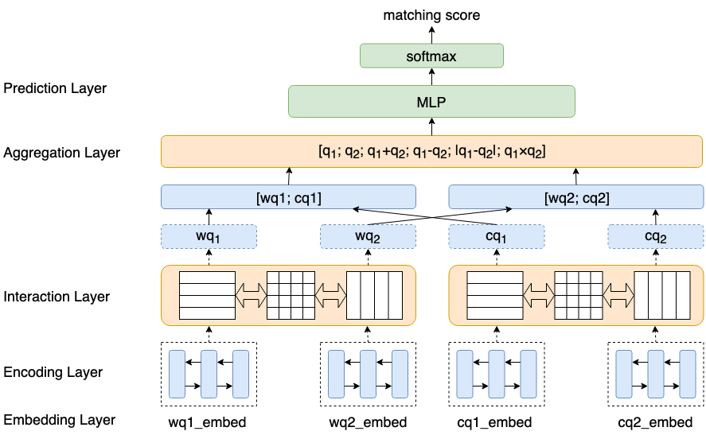

# QQ语义相似度匹配模型

## 数据

接口机100.88.66.85，数据所在文件路径：/ceph/qbkg2/aitingliu/qq/data

分日期存储：如20190726、20190809等

每个日期文件夹下又会有以下几个文件夹：

raw：用于交叉熵损失函数的模型

triplet：用于max-margin-loss的模型

for_bert（optional）：用于BERT

每个文件夹下会有以下文件：（以20190809版本数据为例）

| raw文件夹下的文件            | 备注                                                         | 格式                     |
| ---------------------------- | ------------------------------------------------------------ | ------------------------ |
| merge_20190809_check_seg.txt | 分词后的标注数据                                             | query\tquestion\tlabel\n |
| train.txt                    | 对merge_20190809_check_seg.txt文件进行切分得到的训练集（197794） | query\tquestion\tlabel\n |
| dev.txt                      | 验证集（10000）                                              | query\tquestion\tlabel\n |
| test.txt                     | 测试集（10000）                                              | query\tquestion\tlabel\n |
| word.txt                     | word level 词典                                              | word\n                   |
| char.txt                     | char level 词典                                              | char\n                   |

| triplet文件夹下的文件 | 备注             | 格式                                |
| --------------------- | ---------------- | ----------------------------------- |
| train.txt             | 训练集（116424） | query\t正例question\t负例question\n |
| dev.txt               | 验证集（10000）  | query\t正例question\t负例question\n |
| test.txt              | 测试集（10000）  | query\t正例question\t负例question\n |
| word.txt              | word level 词典  | word\n                              |
| char.txt              | char level 词典  | char\n                              |

| for_bert文件夹下的文件 | 备注             | 格式                          |
| ---------------------- | ---------------- | ----------------------------- |
| train.csv              | 训练集（197794） | idx\tquery\tquestion\tlabel\n |
| dev.csv                | 验证集（10000）  | idx\tquery\tquestion\tlabel\n |
| test.csv               | 测试集（10000）  | idx\tquery\tquestion\tlabel\n |

## 模型

APLSTM/APCNN ：[Attentive Pooling Networks](https://arxiv.org/pdf/1602.03609.pdf)

ARCII : [Convolutional Neural Network Architectures for Matching Natural Language Sentences](http://papers.nips.cc/paper/5550-convolutional-neural-network-architectures-for-matching-natural-language-sentences.pdf)

Siamese LSTM/CNN : [Semi-supervised Clustering for Short Text via Deep Representation Learning](https://arxiv.org/pdf/1602.06797.pdf)；[Siamese Recurrent Architectures for Learning Sentence Similarity](https://www.aaai.org/ocs/index.php/AAAI/AAAI16/paper/viewFile/12195/12023)

BiMPM : [Bilateral Multi-Perspective Matching for Natural Language Sentences](https://arxiv.org/pdf/1702.03814.pdf)

FastText :  [Bag of Tricks for Efficient Text Classification](https://arxiv.org/pdf/1607.01759.pdf)

TextCNN : [Convolutional Neural Networks for Sentence Classification](https://arxiv.org/pdf/1408.5882.pdf)

ESIM：[Enhanced LSTM for Natural Language Inference](https://arxiv.org/pdf/1609.06038.pdf)

Siamese LSTM self-attention：[A Structured Self-attentive Sentence Embedding](https://arxiv.org/pdf/1703.03130.pdf)

### 模型框架图

